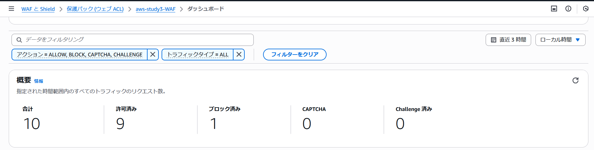
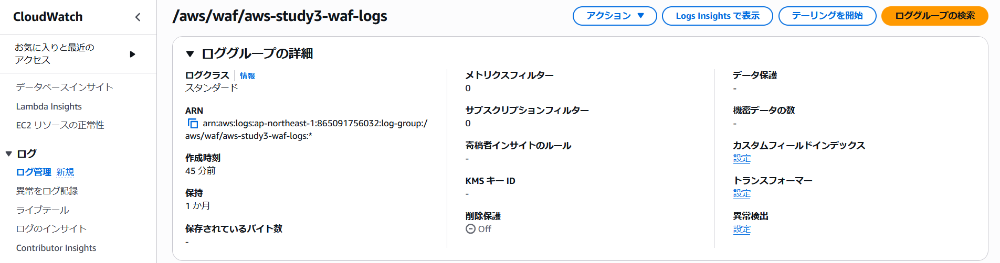
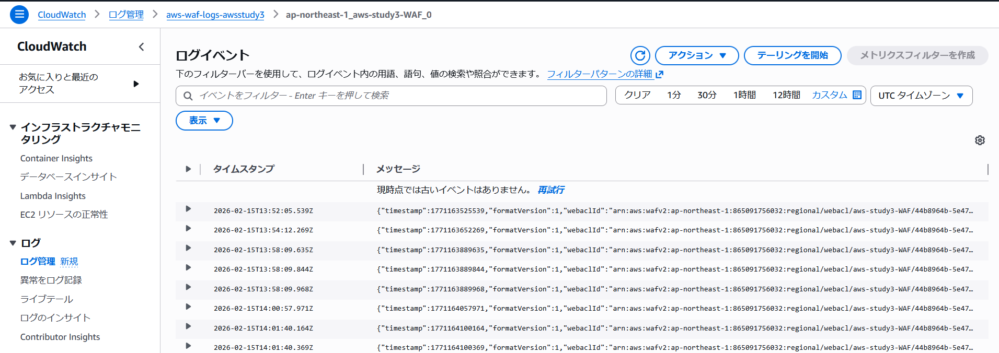
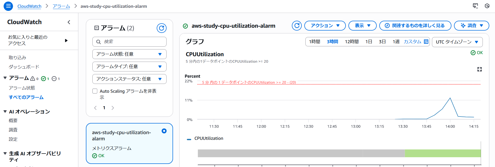

# CloudFormationによるWebアプリケーション環境構築と運用監視

## 概要

CloudFormationを用いて、Webアプリケーションの基本構成および運用監視を含むインフラ環境を構築しました。

---

## 構成内容

### ■ ネットワーク

* VPC（10.0.0.0/16）
* Public Subnet ×2（ALB / EC2用）
* Private Subnet ×2（RDS用）
* Internet Gateway
* Route Table（Public）

---

### ■ サーバー構成

* ALB（Application Load Balancer）
* EC2（Amazon Linux 2023/ Public配置）
* RDS（MySQL / Private配置）

---

### ■ セキュリティ

* Security Group設計

  * ALB → EC2（HTTP / 80, 8080）
  * EC2 → RDS（3306）
  * SSHは特定IPのみ許可
* WAF（AWS Managed Rules）

  * AWSManagedRulesCommonRuleSetを適用

---

### ■ 運用監視・ログ

* CloudWatch

  * EC2 CPU使用率アラーム（10%以上で通知）
* WAFログ

  * CloudWatch Logsへ出力
  * 保持期間：30日

---

## 使用技術

* AWS CloudFormation
* Amazon VPC
* Amazon EC2
* Amazon RDS（MySQL）
* Application Load Balancer
* AWS WAF
* Amazon CloudWatch

---

## デプロイ方法

AWS CloudFormation コンソールから `aws-study3.yaml` を指定してスタックを作成します。  
作成時に以下パラメータを入力します。

- DBUser
- DBPassword

---

## 動作確認

WAFの動作確認

CloudWatch Logsへのロググループ作成確認

WAFログの出力確認

CPU使用率上昇によるアラーム発生確認

---

## 工夫した点・学んだこと

* SSMパラメータストアを利用し、最新のAMIを自動的に参照できるようにしました。

* **Public / Privateサブネットの使い分け**

  * RDSをプライベートサブネットに配置することで、セキュリティを確保できることを学びました。

* **セキュリティグループの最小権限設定**

  * 通信経路をALB → EC2 → RDSに限定してセキュリティを確保できることを学びました。
  * ただし動作確認のためSSHで特定のIPのみからEC2にアクセス可能としています。

* **WAFによるセキュリティ強化**

  * マネージドルールにて基本的なセキュリティ対策が実施できることを学びました。

* **CloudWatchによる運用監視**

  * 閾値を設定し、これによるアラート通知できることを学びました。

* これまでコンソールで実施していたことがコードにすることで簡単に再現性よく構築できることが分かりました。
* 再現性の高い環境構築が可能になることを実感しました。

---
