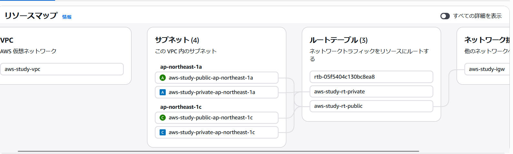
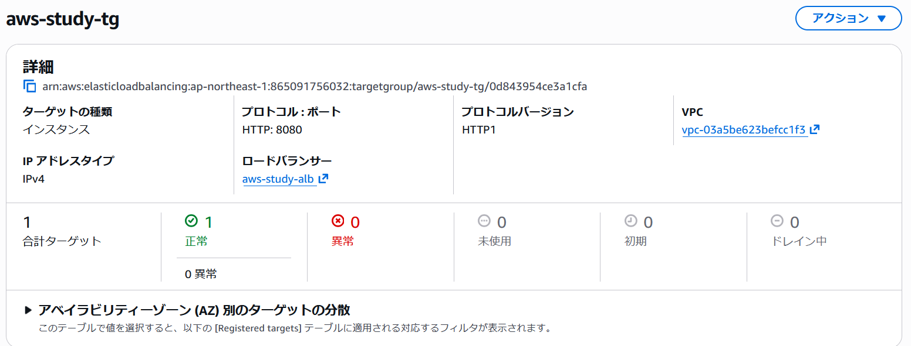
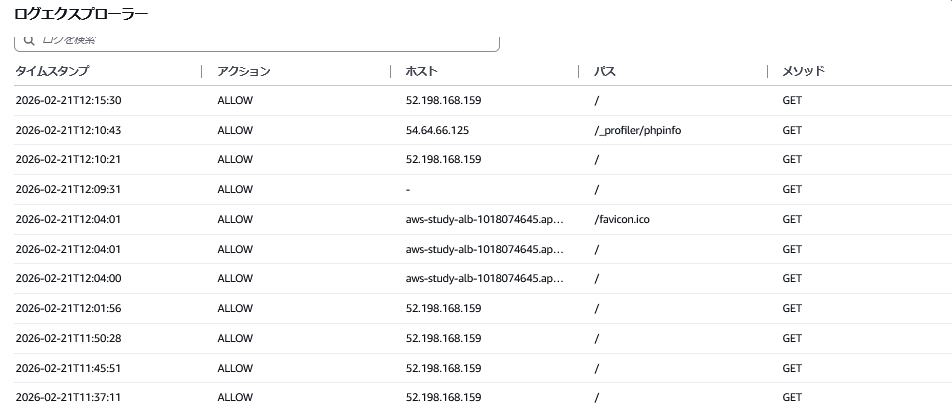
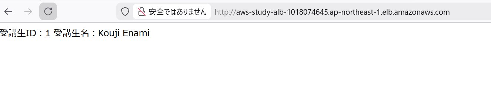
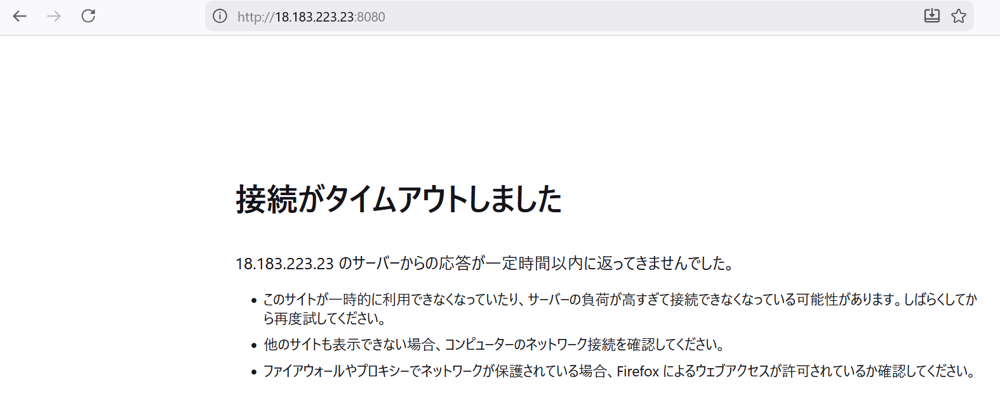

# TerraformによるWebアプリケーション環境構築と運用監視

## 概要

Terraformを用いて、Webアプリケーションの基本構成および運用監視を含むインフラ環境を構築しました。  

---

## 構成内容

### ■ ネットワーク
* VPC（10.0.0.0/16）
* Public Subnet ×2（ALB / EC2用）
* Private Subnet ×2（RDS用）
* Internet Gateway
* Route Table（Public）

---

### ■ サーバー構成
* ALB（Application Load Balancer）
* EC2（Amazon Linux 2023）
* RDS（MySQL / Private配置）

---

### ■ セキュリティ
* Security Group設計
  * ALB → EC2（HTTP / 80, 8080）
  * EC2 → RDS（3306）
  * SSHは特定IPのみ許可
* WAF（AWS Managed Rules）
  * AWSManagedRulesCommonRuleSetを適用

---

### ■ 運用監視・ログ

* WAFログ
  - CloudWatch Logsへ出力し、リクエスト内容を確認可能

---

## 使用技術
* Terraform
* AWS（VPC / EC2 / RDS / ALB / WAF / CloudWatch）
* S3（backend）
* DynamoDB（ロック管理）

---

## backend構成

Terraformのstate管理は以下の構成としています。
* S3にstateファイルを保存
* DynamoDBでロック管理（同時実行防止）

---

## ディレクトリ構成

```bash
terraform-webapp-monitoring/
├── src/    # Terraformコード
├── docs/   # 動作確認
└── README.md
---

## 実行方法
```bash
cd src
terraform init
terraform validate
terraform plan
terraform apply

作成時に以下パラメータを入力します。
- DBUser
- DBPassword

---

## 動作確認

VPC状態


Target状態


WAF動作


CloudWatchログ


ALB経由のアクセス


EC2への直接アクセス（アクセス不可）


---

## 工夫した点・学んだこと
* ファイルの分割
  - リソース毎に分けて分かりやすくしました
* backendによるstate管理
  
  - S3とDynamoDBを利用し、stateの共有とロック制御を行いました

* Terraformにより、インフラ構築をコードで再現できることを理解しました。


