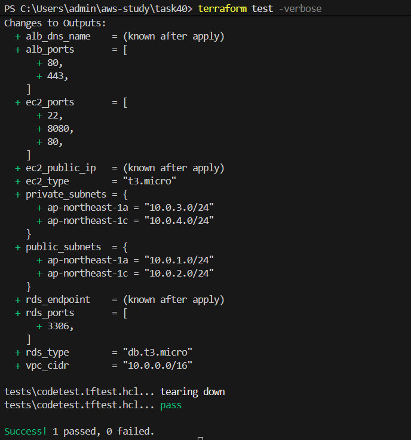
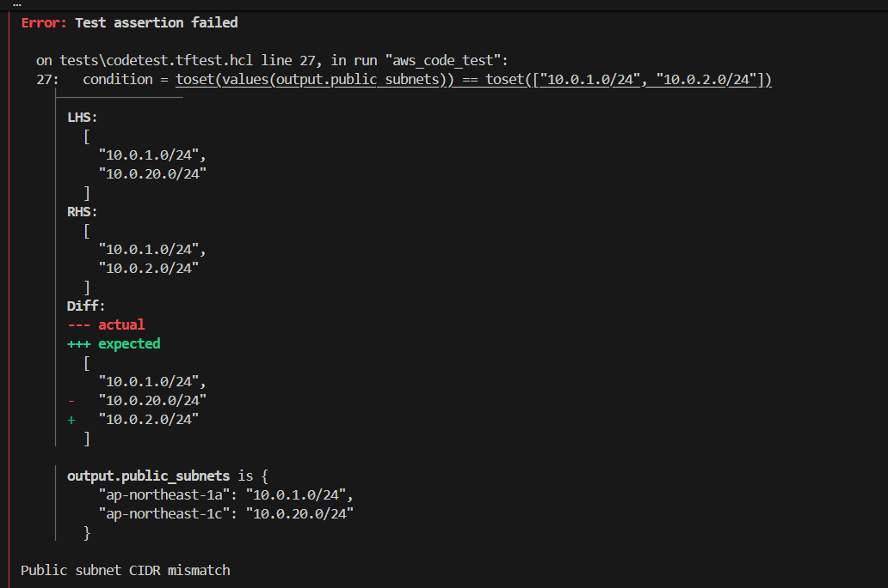

# インフラ環境の自動テスト

## 概要
Terraform testを用いて、構築したインフラ環境が意図通りの設定になっているかを自動で検証しました。

---

## 環境構成

### ■ ネットワーク
* VPC（10.0.0.0/16）
* Public Subnet ×2（[10.0.1.0/24]、[10.0.2.0/24]）
* Private Subnet ×2（[10.0.3.0/24]、[10.0.4.0/24]）
* Internet Gateway
* Route Table（Public）

---

### ■ サーバー構成
* ALB（Application Load Balancer）
* EC2（t3.micro）
* RDS（db.t3.micro）

---

### ■ セキュリティ
* Security Group設計
  * ALB HTTP(80), HTTPS(443)
  * EC2 HTTP(80), HTTP(8080), SSH(22)
  * RDS MySQL(3306)
* WAF（AWS Managed Rules）
  * AWSManagedRulesCommonRuleSetを適用

---

### ■ 運用監視・ログ

* WAFログ
  - CloudWatch Logsへ出力し、リクエスト内容を確認可能

---

## 使用技術
* Terraform
* AWS（VPC / EC2 / RDS / ALB / WAF / CloudWatch）
* S3（backend）
* DynamoDB（ロック管理）

---

## backend構成（参考）

TerraformのstateはS3で管理し、DynamoDBでロック制御を行っています。

---

## ディレクトリ構成

```bash
tf-webapp-monitoring-tests/
├── src/
│   ├── *.tf        # Terraformリソース定義
│   └── tests/      # Terraform test用のテスト定義
├── docs/　　　　　　# 動作確認
└── README.md
```

--- 

## テスト内容
* VPCのCIDRブロックが正しいか
* パブリックサブネットのCIDRブロック確認
* プライベートサブネットのCIDRブロック確認
* ALB、EC2、RDSのポート設定確認
* EC2、RDSのインスタンスタイプ確認

--- 

## テスト方法

事前に環境変数 `TF_VAR_db_username` と `TF_VAR_db_password` を設定したうえで、以下を実行します。

```bash
cd src
terraform init
terraform test
```
---

## 動作確認

テスト成功時


テスト失敗時


---

## 工夫した点・学んだこと
* Terraform testの活用
  - Terraform testを用いることで、インフラ構成の正しさをコードで検証できることを学びました。

* 構成ミスの防止
  - CIDRやポート設定などの誤りを自動で検出できるため、ヒューマンエラーの削減につながると実感しました。


