# Terraform × GitHub Actions × Ansible によるAWS自動CI/CDパイプライン構築   

## 概要
GitHub Actionsを用いて、TerraformによるAWSインフラ構築から、
Ansibleによるアプリデプロイまでを一貫したCI/CDパイプラインを構築しました。

CIではコードの検証と差分検出を実施し、
CDではdev環境での事前検証後、承認フローを経てprod環境へデプロイされる構成としています。

---

# 背景

本構成はスクールの学習課題をベースとしていますが、
以下の点を意識して改善・理解を深めました。

* CI/CDの役割分離（CI：検証、CD：デプロイ）
* dev → prodの段階的デプロイ構成
* TerraformとAnsibleの役割分担の明確化
* 手動作業を排除した自動化の実現

---

## 環境構成

### ■ ネットワーク
* VPC（10.0.0.0/16）
* Public Subnet ×2（10.0.1.0/24、10.0.2.0/24）
* Private Subnet ×2（10.0.3.0/24、10.0.4.0/24）
* Internet Gateway
* Route Table（Public）

---

### ■ サーバー構成

* ALB（Application Load Balancer）
* EC2（t3.micro）×1
* RDS（db.t3.micro）×1

---

### ■ セキュリティ
* Security Group設計
  * ALB HTTP(80), HTTPS(443)
  * EC2 HTTP(8080)
  * RDS MySQL(3306)
* WAF（AWS Managed Rules）
  * AWSManagedRulesCommonRuleSetを適用

---

### ■ 運用監視・ログ

* WAFログ
  - CloudWatch Logsへ出力し、リクエスト内容を確認可能

---

  ## 構成図


---


## 使用技術
* Terraform（IaC）
* GitHub Actions（CI/CD）
* Ansible（アプリデプロイ自動化）
* AWS（VPC / EC2 / RDS / ALB / WAF / CloudWatch）
* SSM（EC2接続）
* S3（backend）
* DynamoDB（ロック管理）

---

## ディレクトリ構成

```bash
aws-study/
├── .github/
│   └── workflows/
│       └── ansible-app-deploy.yml     # Terraform + AnsibleによるCI/CD
│ 
├── projects/
│   └── ansible-app-deploy/
│       ├── tf/                        # Terraformリソース定義
│       │   ├── *.tf                   # 各種リソース（VPC / EC2 / ALB / RDSなど）
│       │   └── tests/                 # Terraform test用のテスト定義
│       ├── ansible/                   # ansible
│       │   ├── playbook.yml           # playbook
│       │   └── templates/             # templatesファイル
│       └── docs/                      # 実行結果（plan / apply証跡）、構成図
│
└── README.md
```

--- 

## テスト内容
* VPCのCIDRブロックが正しいか
* パブリックサブネットのCIDRブロック確認
* プライベートサブネットのCIDRブロック確認
* ALB、EC2、RDSのポート設定確認
* EC2、RDSのインスタンスタイプ確認

--- 

## CI（継続的インテグレーション）

PR作成時 および workflow_dispatch 時にdev環境で自動実行

```bash
CI（検証）
  ├ terraform fmt
  ├ terraform validate
  ├ terraform test
  └ terraform plan
```

---

## CD（継続的デプロイ）
* 事前確認（dev環境）
workflow_dispatchを用いて手動実行

```bash
CD（dev環境）
  ├ terraform apply（インフラ構築）
  └ ansible-playbook（アプリデプロイ）
```

* 本番デプロイ（prod環境）
mainブランチへマージ時に承認確認
承認後に自動実行

```bash
CD（prod環境）
  ├ terraform fmt
  ├ terraform validate
  ├ terraform test
  ├ terraform plan
  ├ terraform apply（インフラ構築）
  └ ansible-playbook（アプリデプロイ）
```
---

## 動作確認

* CI：Terraformの構文チェック・テスト・planが正常終了
* CD（dev）：インフラ構築〜アプリデプロイまで成功
* CD（prod）：承認フロー後に自動デプロイ成功
* ALB経由でアプリ正常動作を確認
* EC2再起動後もアプリが自動起動することを確認

* CI確認
  - planが正常実行されることを確認

  ■ planが正常終了

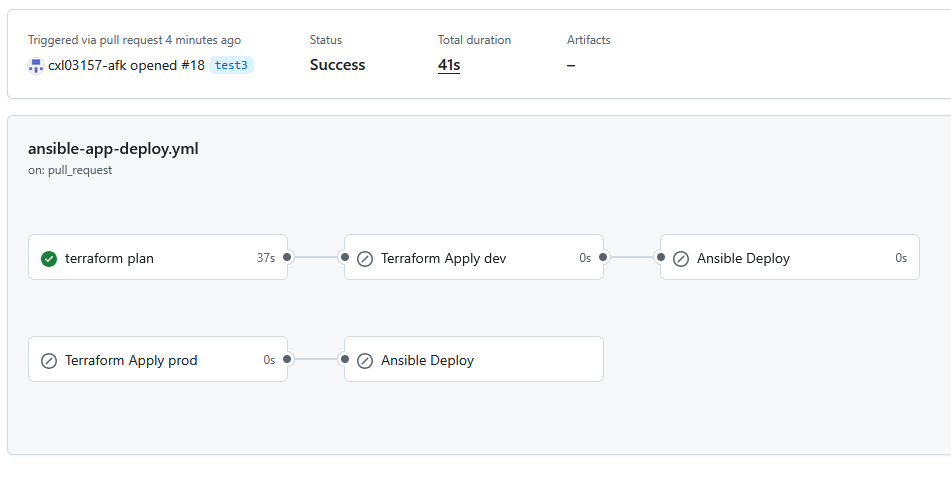


  ■ planの内容

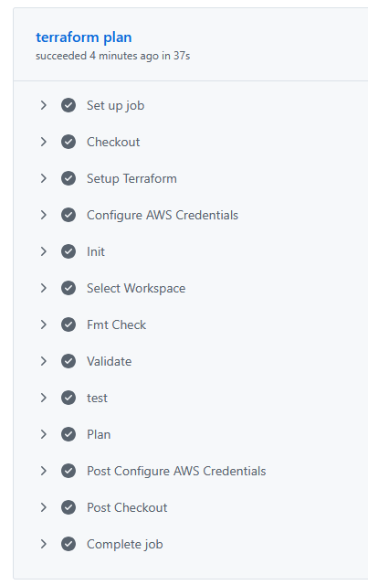


* CD確認
  - dev環境で手動applyし、構成通りにリソースが作成されることを確認

 手動apply結果

  ■ アプリデプロイまで正常終了
  
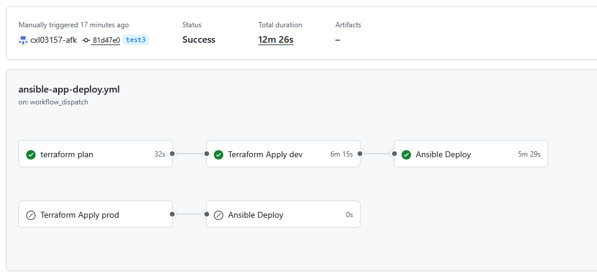


  ■ Terraformでの環境デプロイ内容
  
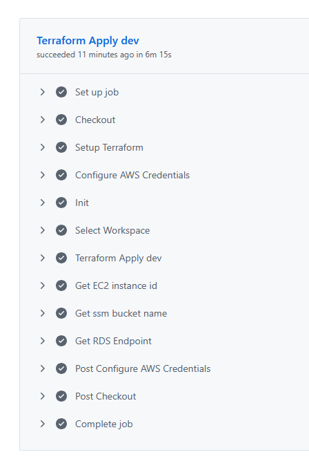


  ■ Ansibleでのアプリデプロイ内容
  
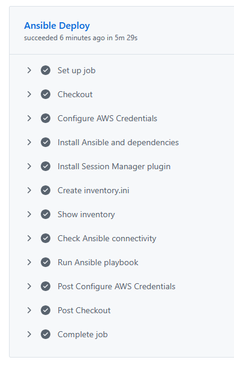


  ■ ALBからのアクセス結果
  
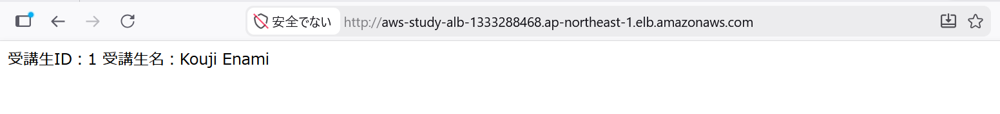


  ■ EC2を停止して再起動後の動作確認
  
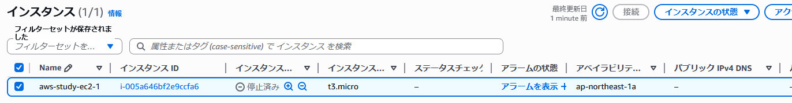


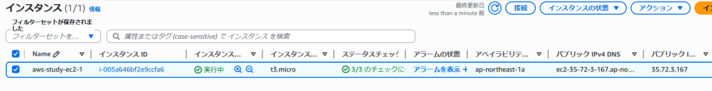


  - mainマージして承認後にprod環境に自動デプロイされることを確認

  ■ 承認待ち状態
  
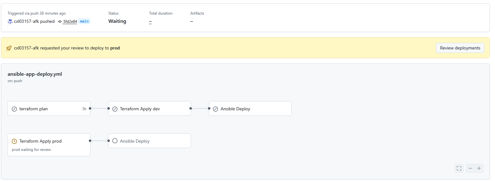


  ■ 承認後の動作状態
  
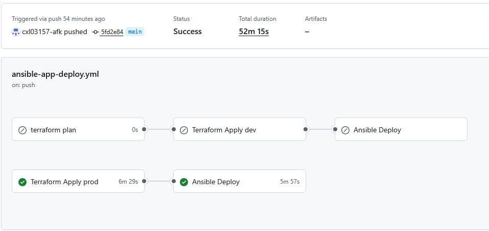


  ■ ALBからのアクセス状態
  
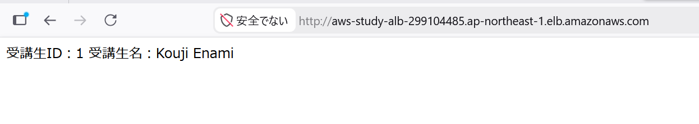


  ■ EC2状態
  
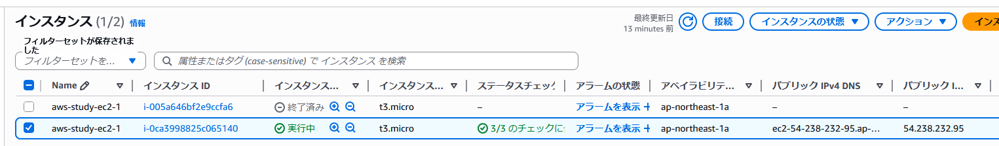


  ■ SSM状態
  
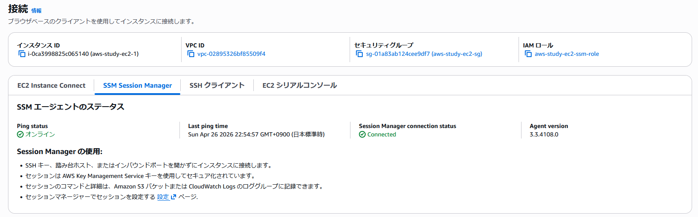


  ■ アプリ動作状態
  
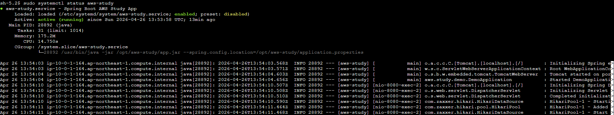

---

## 工夫した点・学んだこと

* CIとCDを分離し、品質担保とデプロイの責務を明確化
* Terraform testを導入し、インフラの検証を自動化
* workflow_dispatchを利用し、mainマージ前に安全な動作確認を実施
* Ansibleを統合し、インフラ構築からアプリデプロイまで一貫して自動化
* EC2再起動後のアプリ自動起動を確認し、運用面も考慮

---
## 成果

* インフラ構築〜アプリデプロイまでの完全自動化を実現
* 手動作業を排除し、再現性の高い環境構築を達成
* PRベースの安全なデプロイフローを確立
* 実務に近いCI/CD構成の理解を深めた

---
