# GitHub Actionsによるインフラ環境のCI/CD

## 概要
GitHub Actionsを用いて、Terraformで構築したAWSインフラ環境に対して  
CI/CDパイプラインを構築し、自動検証およびデプロイの仕組みを実装しました。

また、構成変更（EC2のスケール）を行い、CI/CDが正しく動作することを確認しました。

---

## 環境構成

### ■ ネットワーク
* VPC（10.0.0.0/16）
* Public Subnet ×2（10.0.1.0/24、10.0.2.0/24）
* Private Subnet ×2（10.0.3.0/24、10.0.4.0/24）
* Internet Gateway
* Route Table（Public）

---

### ■ サーバー構成

#### 1回目（初期構成）
* ALB（Application Load Balancer）
* EC2（t3.micro）×1
* RDS（db.t3.micro）×1

#### 2回目（構成変更）
* ALB（Application Load Balancer）
* EC2（t3.micro）×2
* RDS（db.t3.micro）×1

※ EC2を1台から2台に増加させ、スケーラブルな構成へ変更

---

### ■ セキュリティ
* Security Group設計
  * ALB HTTP(80), HTTPS(443)
  * EC2 HTTP(8080)
  * RDS MySQL(3306)
* WAF（AWS Managed Rules）
  * AWSManagedRulesCommonRuleSetを適用

---

### ■ 運用監視・ログ

* WAFログ
  - CloudWatch Logsへ出力し、リクエスト内容を確認可能

---

## 使用技術
* GitHub Actions
* Terraform
* AWS（VPC / EC2 / RDS / ALB / WAF / CloudWatch）
* SSM（EC2接続）
* S3（backend）
* DynamoDB（ロック管理）

---

## ディレクトリ構成

```bash
aws-study/
├── .github/
│   └── workflows/
│       └── terraform-aws-deploy.yml   # CI/CD（Terraform自動実行）
│
├── projects/
│   └── terraform-aws-deploy/
│       ├── tf/                        # Terraformリソース定義
│       │   ├── *.tf                   # 各種リソース（VPC / EC2 / ALB / RDSなど）
│       │   └── tests/                 # Terraform test用のテスト定義
│       │
│       └── docs/                      # 実行結果（plan / apply証跡）
│
└── README.md
```

--- 

## テスト内容
* VPCのCIDRブロックが正しいか
* パブリックサブネットのCIDRブロック確認
* プライベートサブネットのCIDRブロック確認
* ALB、EC2、RDSのポート設定確認
* EC2、RDSのインスタンスタイプ確認

--- 

## CI（継続的インテグレーション）

GitHub Actionsにより、PR作成時にdev環境で自動実行

```bash
CI（検証）
  ├ terraform fmt
  ├ terraform validate
  ├ terraform test
  └ terraform plan
```
構成変更時に、意図した差分が出ることを確認

---

## CD（継続的デプロイ）
* 事前確認（dev環境）
workflow_dispatchを用いて手動実行

```bash
CD（dev環境）
  └ terraform apply
```

* 本番デプロイ（prod環境）
mainブランチへマージ時に自動実行

```bash
CD（prod環境）
  ├ terraform fmt
  ├ terraform validate
  ├ terraform test
  ├ terraform plan
  └ terraform apply
```

---

## 動作確認

* CI確認
  - 初期構成（EC2×1）でplanが正常実行されることを確認
  - 構成変更（EC2×2）後もplanが正常に差分検出されることを確認

プラン結果　EC2x1
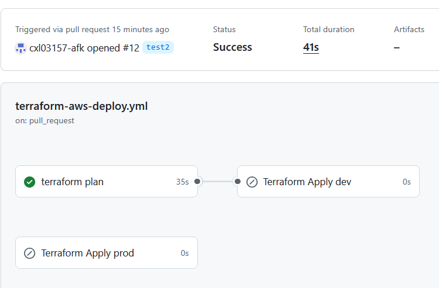

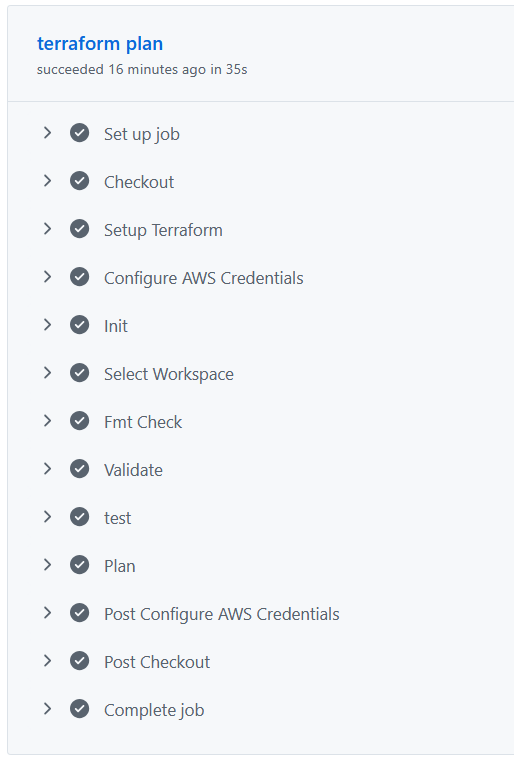


プラン結果　EC2x2
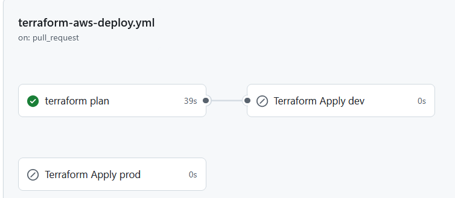


* CD確認
  - dev環境で手動applyし、構成通りにリソースが作成されることを確認

※EC2にアプリ入れる前なのでhelth checkは異常となっています

手動apply結果　EC2x1
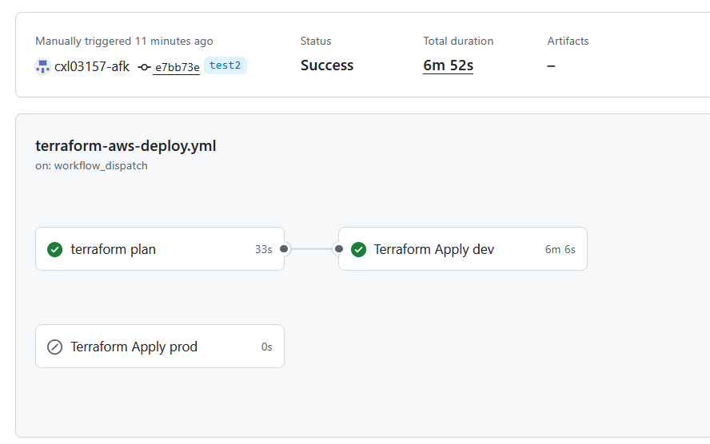
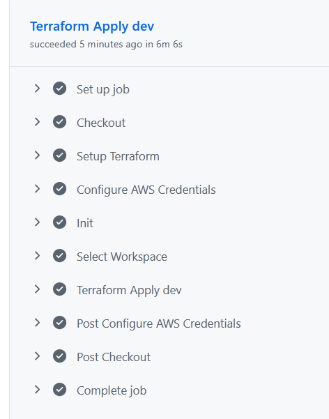
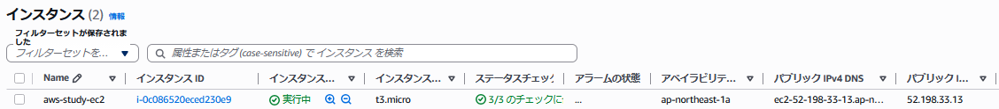
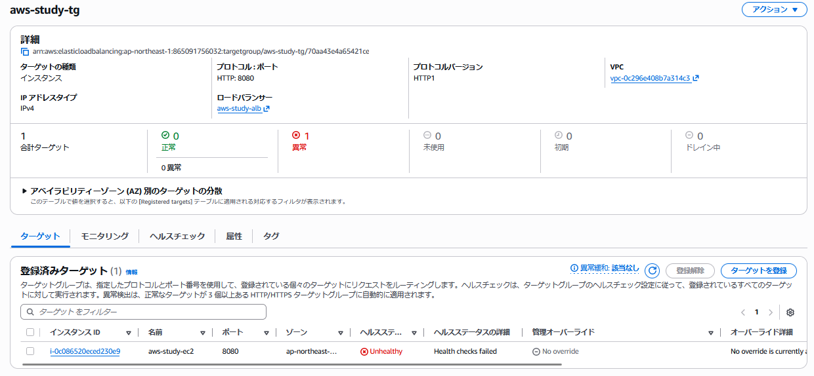

手動apply結果　EC2x2
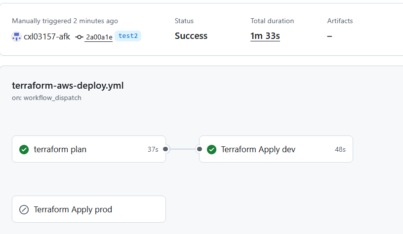
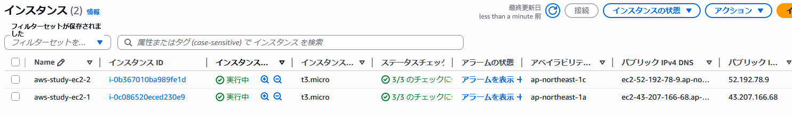
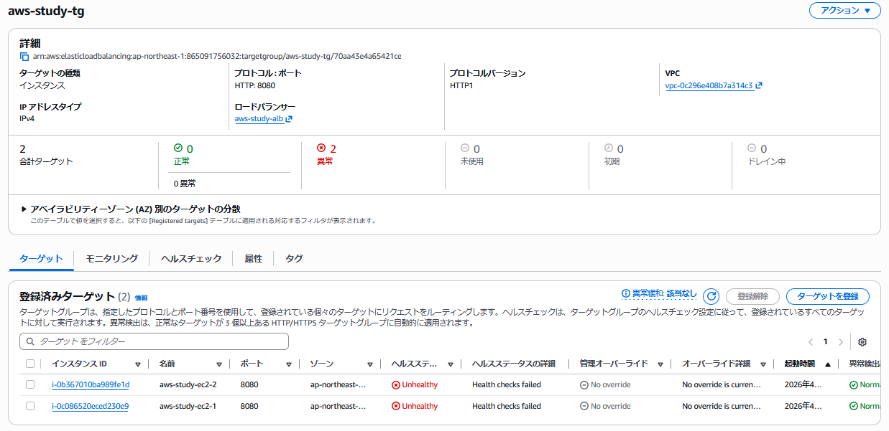


  - mainマージ後、prod環境に自動デプロイされることを確認
  
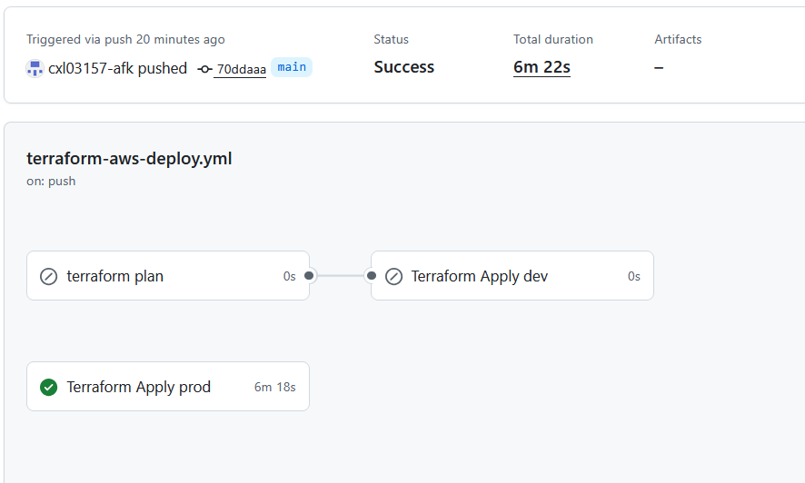
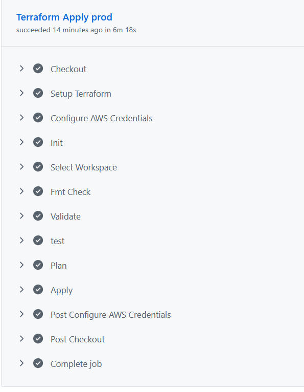

---

## 工夫した点・学んだこと
* CI/CDの分離
  * CI：検証（planまで）
  * CD：デプロイ（apply）

* 事前デプロイ確認
  * workflow_dispatchを利用し、mainマージ前に動作確認

* スケーラブルな構成への変更
  * EC2を1台→2台へ変更し、ALB配下での負荷分散を実施
